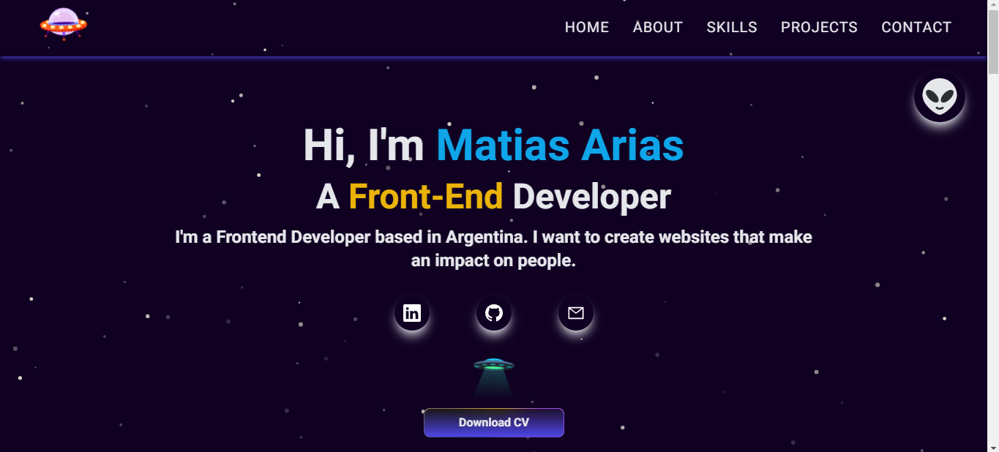
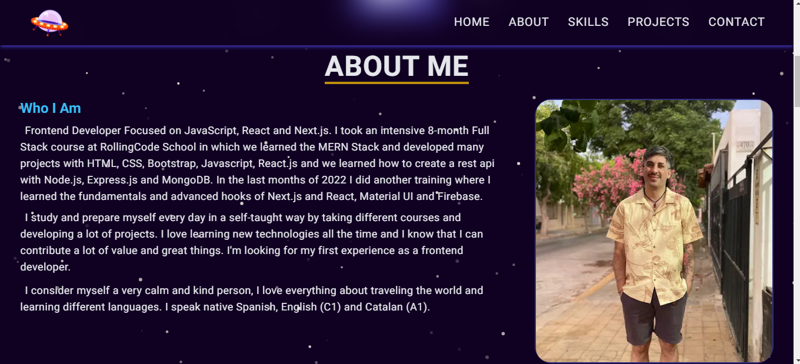
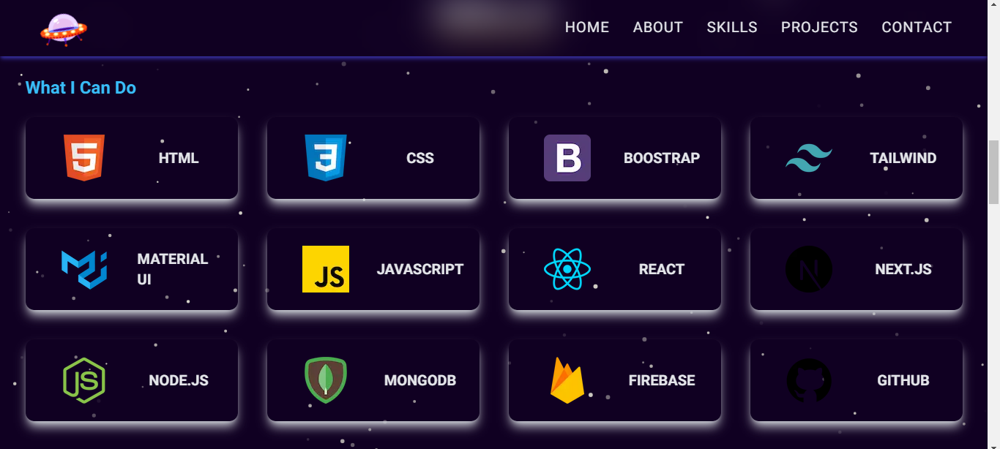
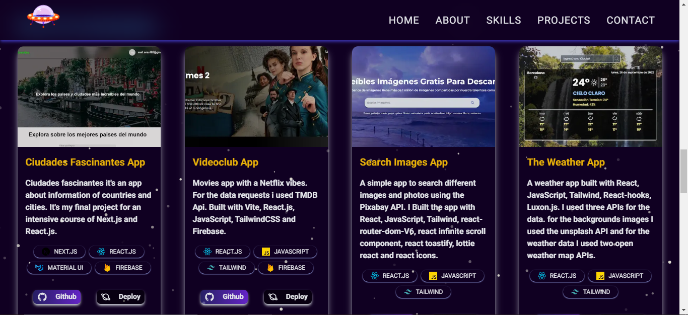
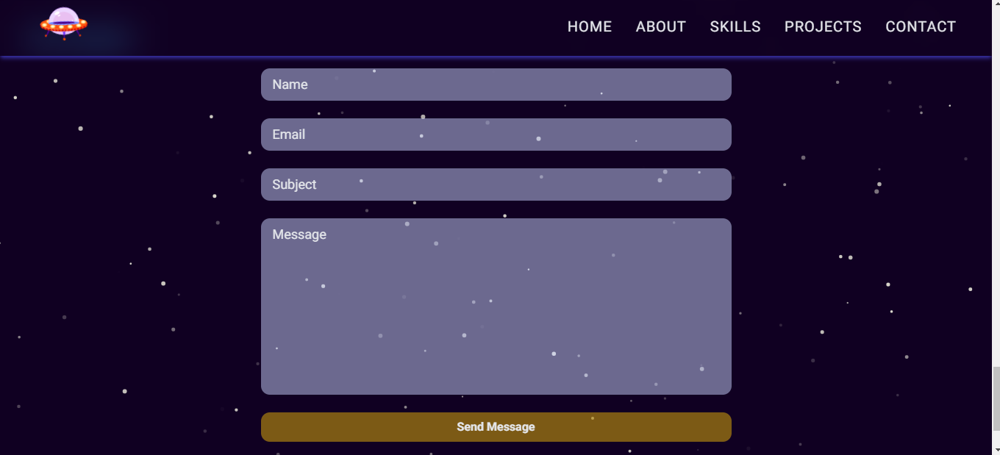

# My Portfolio — Matias Arias

Personal portfolio showcasing my work as a Frontend Developer. Single-page site built with **Next.js**, **React**, **TypeScript**, and **Tailwind CSS**, with animations powered by Framer Motion.

**Live site:** [https://matiasarias.vercel.app/](https://matiasarias.vercel.app/)

---

## What's inside

The site is a one-page experience with these sections:

| Section | Description |
|---------|-------------|
| **Home** | Hero with social links, Lottie animations, and background music |
| **About** | Bio and professional photo |
| **Experience** | Work history |
| **Skills** | Tech stack grid |
| **Projects** | Featured projects with links to GitHub and live demos |
| **Contact** | Form powered by EmailJS |

---

## Tech stack

| Category | Technology |
|----------|------------|
| Runtime | Node.js 24+ |
| Framework | Next.js 16 (Pages Router) |
| UI | React 19 |
| Language | TypeScript 5 |
| Styling | Tailwind CSS 3 |
| Animations | Framer Motion |
| Particles | @tsparticles/react |
| Lottie | lottie-react |
| Contact form | EmailJS |
| Notifications | react-toastify |
| Scroll animations | react-intersection-observer |
| Typewriter effect | typewriter-effect |
| Icons | react-icons |
| Linting | ESLint 9 + eslint-config-next 16 |
| Deploy | Vercel |

---

## Getting started

### Prerequisites

- [Node.js 24+](https://nodejs.org/) (use `nvm use` if you have `.nvmrc`)

### Install and run

```bash
# Install dependencies
npm install

# Development server (http://localhost:3000)
npm run dev

# Production build
npm run build

# Run production server
npm run start

# Lint
npm run lint
```

`npm run lint` uses ESLint's flat configuration (`eslint.config.mjs`).

## Environment variables

The contact form requires EmailJS public configuration. Copy `.env.local.example` to `.env.local` and replace the placeholder values:

```env
NEXT_PUBLIC_EMAILJS_SERVICE_ID=service_xxxxxxx
NEXT_PUBLIC_EMAILJS_TEMPLATE_ID=template_xxxxxxx
NEXT_PUBLIC_EMAILJS_PUBLIC_KEY=xxxxxxxxxxxxxxxx
```

Do not commit `.env.local`. These values are exposed to the browser by EmailJS's client-side integration, so configure the corresponding EmailJS domain restrictions.

## Fonts

The global Lato font is loaded with `next/font/google`. Next downloads and self-hosts its font files during a successful build, so the build environment must be able to reach Google Fonts when no cache is available. The deployed site serves the generated font files locally.

---

## Project structure

```
├── pages/           # Next.js routes (Pages Router)
├── components/      # Main page sections
├── subComponents/   # Reusable UI pieces
├── data/            # Static data (projects, skills, experience)
├── types/           # TypeScript interfaces
├── config/          # JSON configs (e.g. particles)
├── public/          # Static assets
├── styles/          # Global CSS (Tailwind)
├── eslint.config.mjs # ESLint 9 flat configuration
├── .env.local.example # EmailJS environment-variable template
└── AGENTS.md        # Agent/contributor reference
```

Imports use the `@/` alias (configured in `tsconfig.json`).

---

## Screenshots











---

## Author

**Matias Arias** — Frontend Developer based in Argentina.

- [LinkedIn](https://www.linkedin.com/in/matiasarias27)
- [GitHub](https://github.com/matiarias)
- [Email](mailto:matt.arias182@gmail.com)
